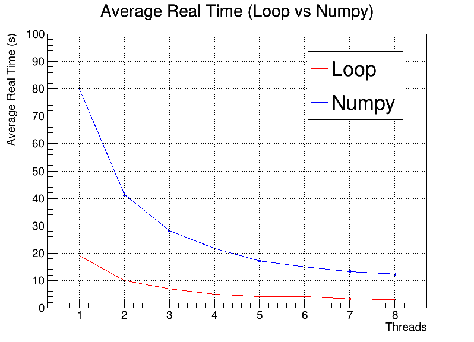
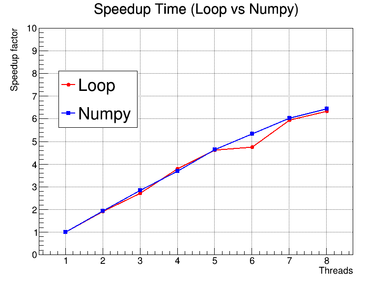

# Numba-Numpy Benchmarking

## Overview

This repository contains benchmarking results for `Numba` with `NumPy`. 
We conducted benchmark tests to evaluate the performance of Numba when using NumPy compared to using raw loops.

## Conditions

* `Numba` version: `0.57.1`
* `Numpy` version: `1.24.4`
* `Python` version: `3.11.4`
* `ROOT` version: `6.29/01`
* Each test was run `10` times and an average of the execution time was calculated.
* The tests were run on a `linux fedora 38` station.

## Real Time Benchmarking:

  

This figure represents the results of our benchmarking for real-time performance. The x-axis represents the number of threads, and the y-axis represents the average real-time execution in seconds.

**Some observations:**

 * As the number of threads increases, there is a noticeable decrease in average real-time execution for both the `loop` and `Numpy` implementations. This suggests that `Numba`, when combined with `NumPy`, can take advantage of multi-threading and scale with the number of threads.

 * The `loop` implementation consistently outperforms the `Numpy` implementation as the number of threads increases.

## Speedup Benchmarking:

  

This figure illustrates the speedup factor when using `Numba` with `NumPy` compared to the `loop` implementation. The x-axis represents the number of threads, and the y-axis represents the speedup factor.

**Some observations:**

* The speedup factor indicates how much faster the `Numba` with both `NumPy` and `loop` implementations are. `Numba` had issues with this in the past versions and the scaling wasn't as expected when using `Numpy`.

* As observed in the figure, the speedup factor increases with the number of threads. For a higher number of threads, `8` in this example, the speedup factor reaches a value of `6.6`. This confirms that `Numba` with `NumPy` scales `linearly` with the number of threads, similarily to how the `loop` implementation scales.
